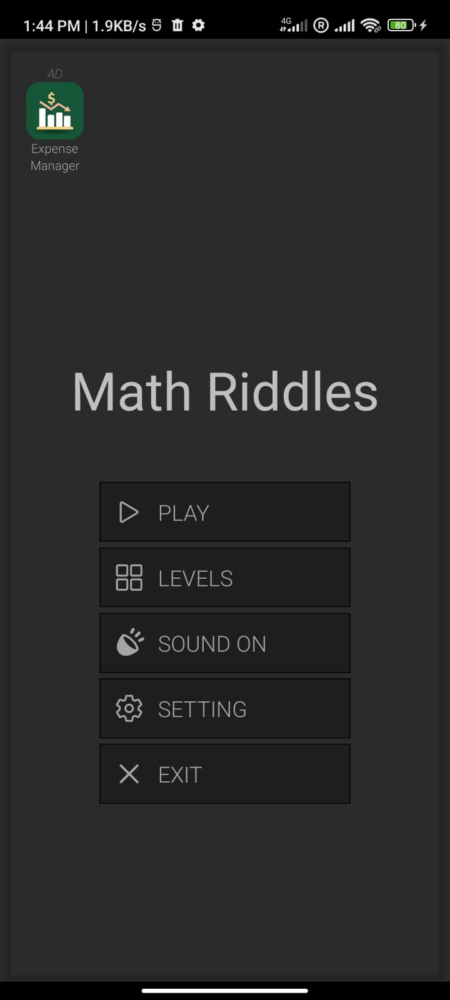
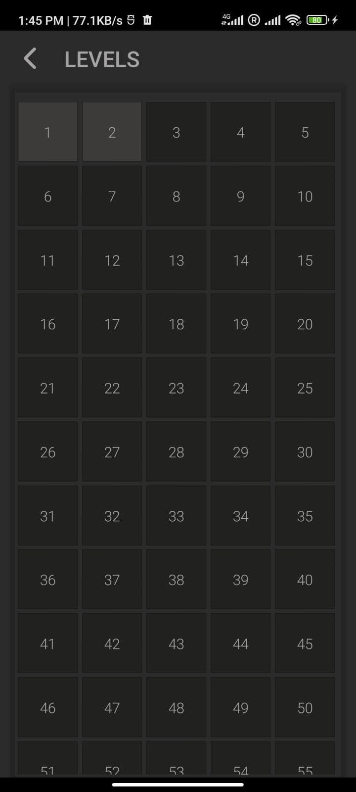
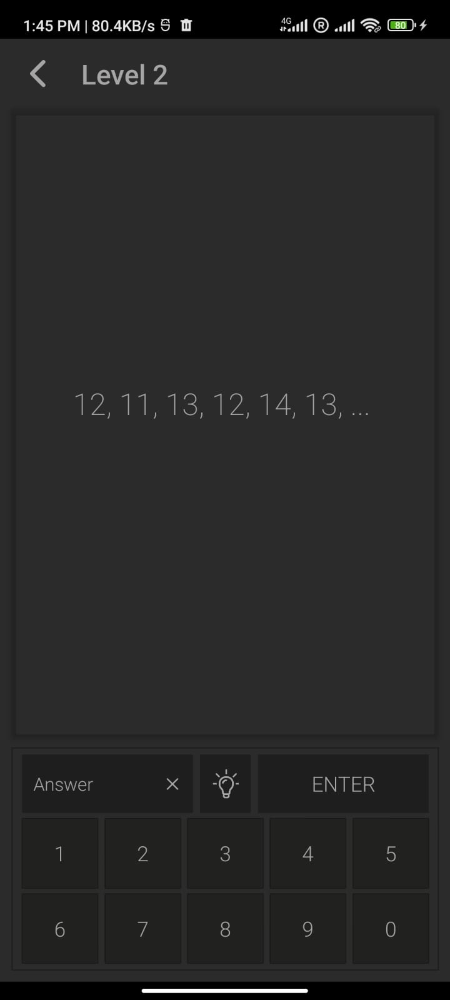

# Math Riddle
## 📱 Overview
The Math Riddle app is a mobile application designed to provide a variety of math-related puzzles and riddles. These riddles typically require logical thinking, problem-solving skills, and mathematical reasoning to solve. 
## 🚀 Features
-  Variety of Puzzles and Riddles
-  Hint System
-  User-Friendly Interface
-  Offline Mode
-  Voice Control

  ## 📸 Screenshots
  

  
  
  
  

## 🛠️ Tech Stack
- **Frontend**: React Native
- **Others**: Single Page Mobile App, Google Admobs
